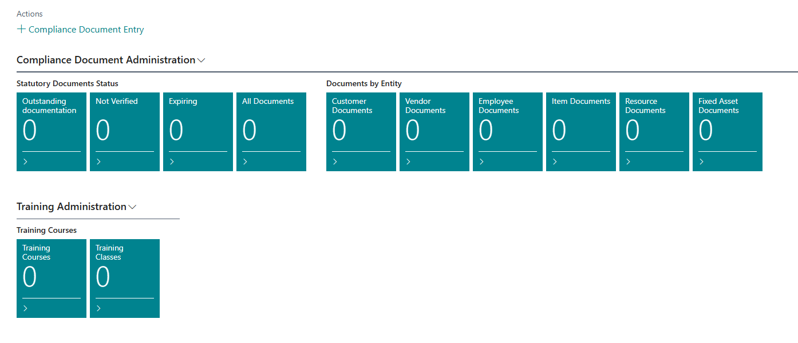
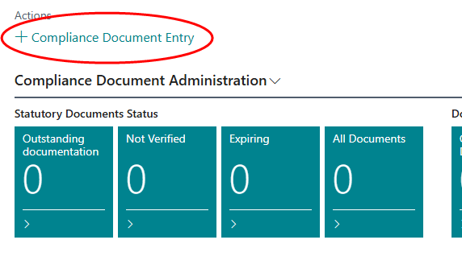
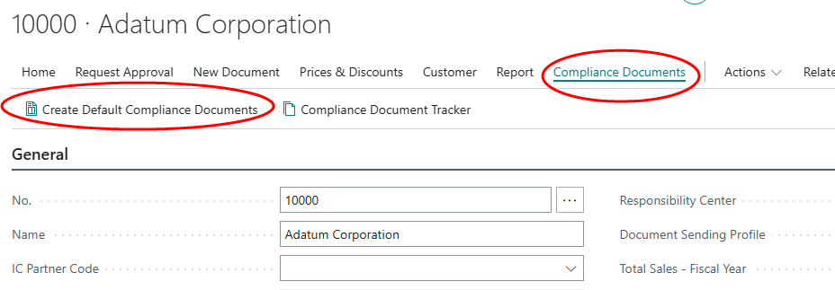
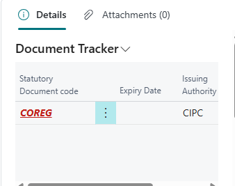

# Compliance Document Tracker

  - [Managing Documents for Entities](#managing-documents-for-entities)
    - [Create a new document](#create-a-new-document)
    - [Approve the document](#approve-the-document)
    - [Managing documents from the entity - Example : Customer](#managing-documents-from-the-entity---example--customer)

## Managing Documents for Entities
An entity is a master record against which you wish to store and manage documents. This could be a supplier, customer, inventory item, fixed asset, resource or employee.

You can manage the documents via an administration role centre, and you can also view and manage the documents for a particular entity from the relevant master maintenance record.

Make sure that your profile is set to 'Document Manager'. The role centre should look something like this:

   

### Create a new document
* Click on '+ Statutory Document' OR open one of the cues, and click New.
   
   

* The Document No. will be allocated automatically from the number series defined during Setup.
* Enter the Document Association (Vendor / Customer / Item / Asset / Resource / Employee), and select an entity to which the document should be attached. 
* Select the document type. The system will automatically populate the validity and issuing authority.
   
   

* Enter the date of issue.
* Enter the number of the document.
* If the documents have been received, attach them to the entry, and update the status to 'Received'.

### Approve the document
If you have the appropriate authority, you can update the status of the entry to 'Approved'.

## Managing documents from the entity - Example : Customer
* Select Customers.
* Open the card for a customer.
* To load the default document types, click on Customer -> Compliance  Documents -> Create Default Compliance Documents.
   

* The Document Tracker fact box will display a list of the documents required.

*  Click on Customer -> Statutory Documents -> Statutory Documents. This will open the list of documents linked to the customer. You can now capture the remaining information such as the date of issue.

The above process applies to all entities.