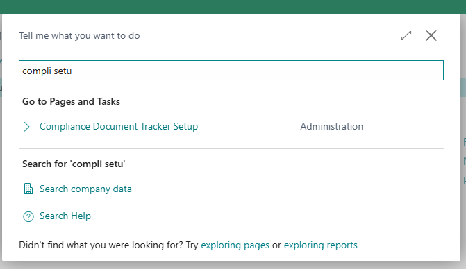
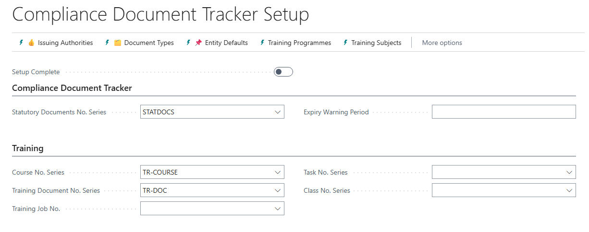

# Compliance Document Tracker

- [Set up new Number Series](#set-up-new-number-series)
- [Capture Setup fields](#capture-setup-fields)
- [Issuing Authorities](#issuing-authorities)
- [Document Types](#document-types)
- [Entity Defaults](#entity-defaults)
- [Training Programmes](#training-programmes)
- [Training Subjects](#training-subjects)
- [Link Skills to Certifications](#link-skills-to-certifications)

## Configuration and Setup

### Set up new Number Series
* Search for No. Series
* Create new number series for:
  * Statutory documents
  * Course Numbers
  * Training Tasks
  * Training Classes
  * Training document numbers (certificates)

### Capture Setup fields
Search for Compliance Document Tracker Setup.

Capture fields for document management
* Statutory Documents number series - used to number entries in the statutory documents table
* Expiry warning period - a date formula which indicates how long before expiry you would like the system to warn you.

Capture fields for training administration
* Course number series
* Training document number series
* Class number series
* Training job number (if integrating to Projects module)
* Class No. Series - for identifying classes

### Issuing Authorities
The organisations (including your own) that are responsible for issuing or certifying the documents you need to maintain are defined here.

From the Statutory Documents Setup page, click on Issuing Authorities. 

Capture the data as follows:

*   Code : unique code to identify the organisation
*   Name - full name of the organisation
*   Membership number - if you have a registration number with the external organisation, enter it here
*   Vendor number - link to a vendor to facilitate payment of membership fees.

### Document Types
The types of document which your organisation needs to store, and the rules of how to manage them, are entered here.  From the Statutory Documents Setup, select 'Document Types':

Capture the information as follows:

| Field Name | Details|
|--|--|
|Statutory Documents Code | A unique code to identify the type of document  |
|Issuing authority | Select the Issuing authority responsible for this document type|
|Validity          | If the document has a limited validity, enter a date formula to calculate the expiry date from date of issue|
|Area of jurisdiction|Free text, indicating where the document is valid eg Global, National, Site|
|Document importance| Optional / Recommended / Mandatory|
|Duplicates allowed| If multiple editions of the same document type can be issued to a particular entity, tick on. If ticked off, the system will prevent you from capturing more than one edition of a document.|
|Extension Period   |                                                       |
|Maximum Extensions allowed |   |
|Associated Entities:|Select the entities to which the document type can be attached: Customer / Vendor / Fixed Asset / Item / Resource / Service Item / Employee ||

### Entity Defaults
This function allows you to define the suggested list of documents that need to be collected for a particular entity. For example, for a new customer, you may want to collect their company registration, VAT registration, BBBEE certificate.

From the Statutory Documents Setup, select 'Entity Defaults'.

Enter fields as follows:

| Field Name                | Statutory Document Type                       | 
| --                        |--                                             |
|Entity Type                | Select from the available entities            |  
|Statutory Document Types   | Select the document type from the list        |
|Document Importance        |                                               |

Repeat for each document required for the entity type. Example:

### Training Programmes
This function allows you to define the outline of a training programme.
Select 'Training Programmes' from the Statutory Documents Setup page.
A list of existing programmes will appear.  Click on New.

Enter General information about the programme:

where applicable, enter Accreditation information:

This will link completed training for an employee to document certifications.

Capture one or more modules / subjects that are offered as part of the course:

### Training Subjects
This function allows you to define subjects on which you will offer training. 

### Link Skills to Certifications

* Search for “Skill codes”.
* Edit the list.
* Next to each skill code, select the applicable certification

